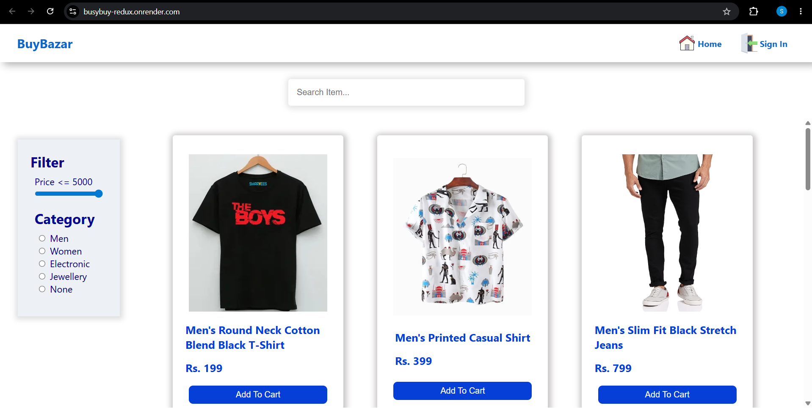
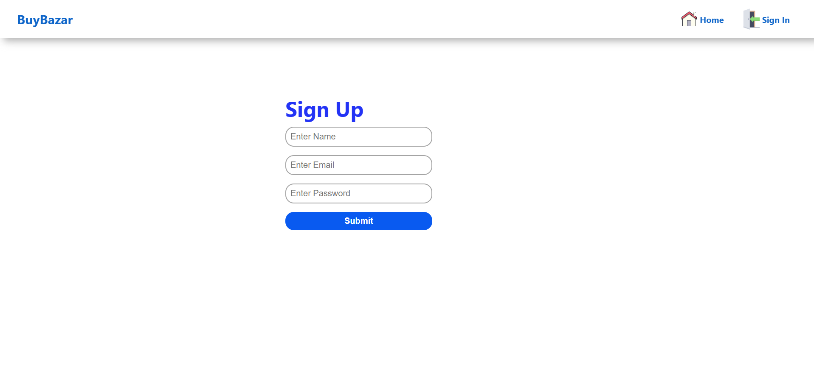
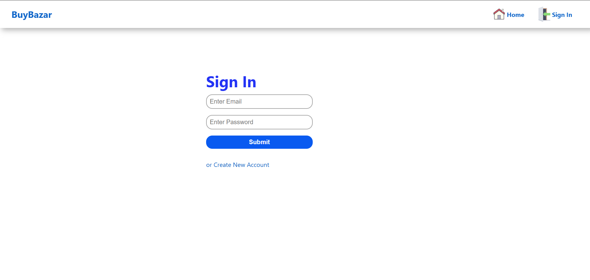
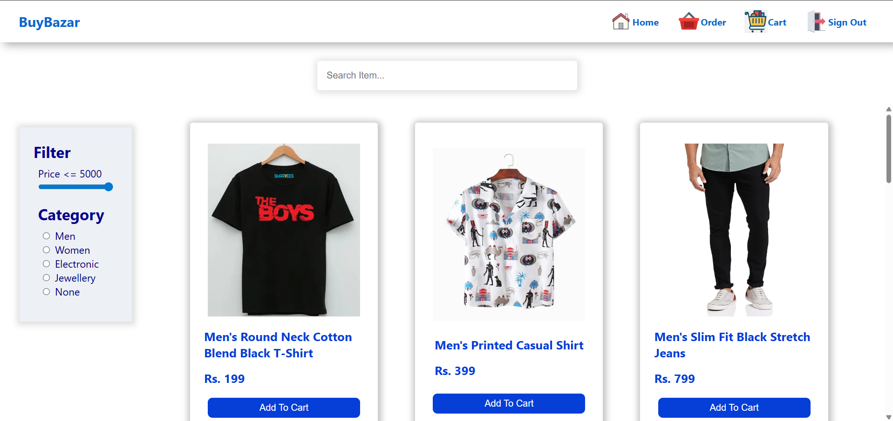
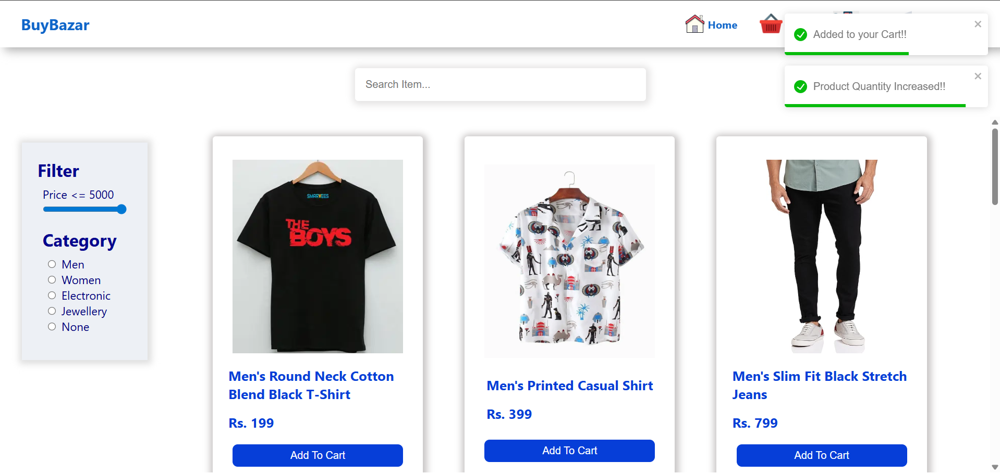
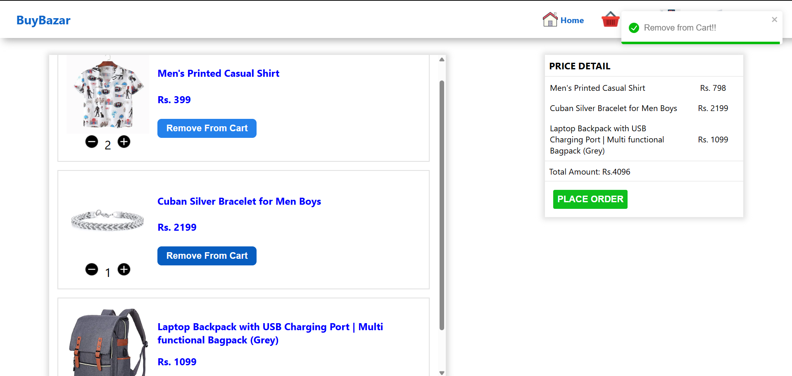
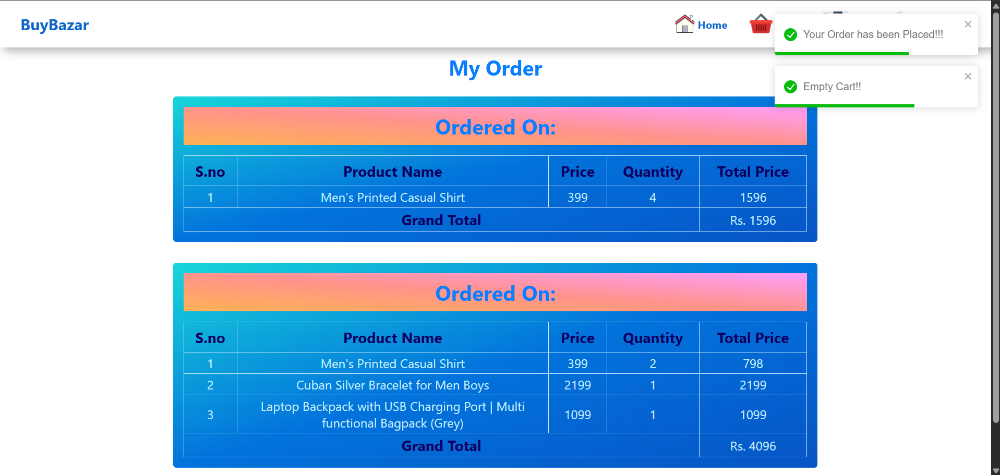

# 🛒 BuyBusy - E-Commerce Web Application

A full-featured E-Commerce web application built using **React.js, Redux Toolkit, Firebase Authentication, and Firestore Database**.

BuyBusy was initially developed as a learning project while exploring React.js and modern frontend development. Later, the application was refactored using Redux Toolkit to improve state management, scalability, and code organization. This project also served as my final-year major project and is now part of my developer portfolio.

The application allows users to create accounts, securely log in, browse products, manage their shopping cart, and place orders through a responsive and user-friendly interface.

## 🚀 Live Demo

🔗 **Live Application:** [BuyBusy Live Demo](https://busybuy-redux.onrender.com/)

## 🔗 Connect With Me

* Portfolio: https://my-portfolio-one-wheat-24.vercel.app/
* LinkedIn: https://www.linkedin.com/in/simran-mandal0211/
* GitHub: https://github.com/SimranMandal0211

---

## 📸 Application Preview

### Home Page (Guest User)



### Sign Up



### Sign In



### Home Page (After Login)



### Product Added Notification



### Shopping Cart



### Orders Page



---

## ✨ Features

### Authentication

* User Registration
* User Login
* Secure Firebase Authentication
* Persistent User Sessions
* Logout Functionality
* Protected Routes

### Product Management

* Browse Available Products
* Product Filtering
* Dynamic Product Rendering
* Responsive Product Layout

### Shopping Cart

* Add Products to Cart
* Increase Quantity
* Decrease Quantity
* Remove Products
* Real-Time Cart Updates

### Order Management

* Purchase All Cart Items
* Store Orders in Database
* View Previous Orders
* Detailed Order History

### User Experience

* Responsive Design
* Loading Indicators
* Toast Notifications
* Error Handling
* Smooth Navigation

---

## 🛠 Tech Stack

### Frontend

* React.js
* React Router DOM
* Redux Toolkit
* React Redux

### Backend & Database

* Firebase Authentication
* Firebase Firestore

### Styling

* CSS3

### Additional Libraries

* React Toastify
* React Spinner Material

### Deployment

* Render

---

## 📂 Project Structure

```text
src/
│
├── components/
│   ├── NavBar
│   ├── Loader
│   ├── CartItem
│   ├── OrderDetail
│   ├── FilterBar
│   └── MainContent
│
├── pages/
│   ├── Home
│   ├── SignIn
│   ├── SignUp
│   ├── Cart
│   ├── Orders
│   └── Error
│
├── redux/
│   ├── authReducer
│   ├── productReducer
│   └── store
│
├── routes/
│
└── App.js
```

---

## 🔄 Application Workflow

### User Authentication

1. User creates an account.
2. User signs in using Firebase Authentication.
3. Session is maintained securely.
4. Protected pages become accessible.
5. User can logout at any time.

### Shopping Workflow

1. Browse products.
2. Add products to cart.
3. Update product quantities.
4. Remove unwanted products.
5. Purchase products.
6. Store order history in the database.
7. View previous orders.

---

## 🧠 Challenges Faced

### Migrating to Redux Toolkit

One of the most challenging parts of this project was refactoring the entire application after learning Redux Toolkit.

The application was originally developed using React's basic state management techniques. After understanding Redux and centralized state management, I decided to rebuild the data flow using:

* Redux Toolkit
* createSlice()
* createAsyncThunk()
* Centralized Redux Store

This migration required restructuring multiple components and solving state synchronization issues across the application.

### Authentication Implementation

Implementing user authentication introduced several challenges, including:

* Managing user sessions
* Protecting authenticated routes
* Synchronizing Firebase authentication state
* Handling login and logout flows

Working through these challenges significantly improved my understanding of frontend architecture and real-world application development.

---

## 🎯 Key Learnings

Through this project, I gained practical experience with:

* React Component Architecture
* React Router DOM
* Redux Toolkit
* Async Thunks
* Global State Management
* Firebase Authentication
* Firestore Database
* Protected Routes
* Application Scalability
* Debugging Complex State Issues
* Deployment Using Render

---

## ⚙️ Installation

Clone the repository:

```bash
git clone YOUR_REPOSITORY_LINK
```

Navigate to the project folder:

```bash
cd buybusy-redux
```

Install dependencies:

```bash
npm install
```

Run the application:

```bash
npm start
```

Open:

```text
http://localhost:3000
```

---

## 🔮 Future Improvements

Planned enhancements include:

* Payment Gateway Integration
* Product Wishlist
* Product Reviews & Ratings
* Advanced Search Functionality
* Product Sorting
* Pagination
* User Profile Management
* Order Tracking System

---

## 👩‍💻 Author

**Simran Mandal**

Feel free to connect with me and explore my other projects.

* GitHub: https://github.com/SimranMandal0211
* LinkedIn: https://www.linkedin.com/in/simran-mandal0211/
* Portfolio: https://my-portfolio-one-wheat-24.vercel.app/

---

⭐ If you found this project interesting, consider giving it a star.
